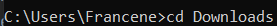
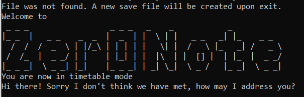
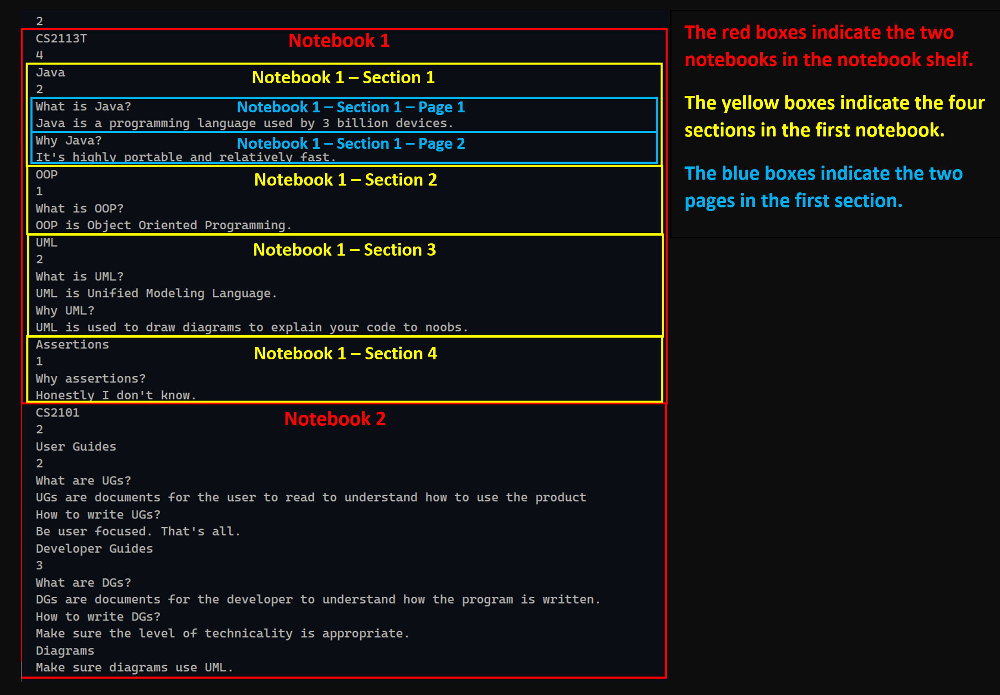

# Zer0Note User Guide

```
          Welcome to
 ______    _ _ _                  _ _ _   _    _            _
|      |  |_ _  |   _ _    _  _  |  _  | |  \ | |   _ _   _| |_    _ _
| 0 u 0|    /  /  /  _  \ | |/_\ | | | | |   \| |  /   \ |_   _| /   _ \
|      |   /  /_  |  _ _/ | |    | |_| | |  |\  | |  [] |  | |_  |  _ _/
|______|  |_ _ _|  \ _ _| |_|    |_ _ _| | _| \_|  \ _ /   |_ _|  \ _ _|
```

## Table of Contents
[**1. Introduction**](#1-introduction) <br>
&nbsp;&nbsp;[1.1. How to use this guide](#11-how-to-use-this-guide) <br>
[**2. Quick Start**](#2-quick-start) <br>
[**3. Features**](#3-features) <br>
&nbsp;&nbsp;[3.1 Viewing the user guide: `help`](#31-viewing-the-user-guide-help) <br>
&nbsp;&nbsp;[3.2 Switching between the two modes: `mode`](#32-switching-between-the-two-modes-mode) <br>
&nbsp;&nbsp;[3.3  Personalised Messages](#33-personalised-messages) <br>
&nbsp;&nbsp;[3.4 Timetable Mode](#34-timetable-mode) <br>
&nbsp;&nbsp;&nbsp;&nbsp;[3.4.1 Adding a task: `add`](#341-adding-a-task-add) <br>
&nbsp;&nbsp;&nbsp;&nbsp;[3.4.2 Marking a task as done: `done`](#342-marking-a-task-as-done-done) <br>
&nbsp;&nbsp;&nbsp;&nbsp;[3.4.3 Tagging a task: `tag`](#343-tagging-tasks-tag) <br>
&nbsp;&nbsp;&nbsp;&nbsp;[3.4.4 Listing tasks: `list`](#344-listing-tasks-list) <br>
&nbsp;&nbsp;&nbsp;&nbsp;&nbsp;&nbsp;[3.4.4.1 Listing all tasks](#3441-listing-all-tasks) <br>
&nbsp;&nbsp;&nbsp;&nbsp;&nbsp;&nbsp;[3.4.4.2 Listing done tasks](#3442-listing-done-tasks) <br>
&nbsp;&nbsp;&nbsp;&nbsp;&nbsp;&nbsp;[3.4.4.3 Listing undone tasks](#3443-listing-undone-tasks) <br>
&nbsp;&nbsp;&nbsp;&nbsp;&nbsp;&nbsp;[3.4.4.4 Listing urgent tasks](#3444-listing-urgent-tasks) <br>
&nbsp;&nbsp;&nbsp;&nbsp;[3.4.5 Finding tasks: `find`](#345-finding-tasks-find) <br>
&nbsp;&nbsp;&nbsp;&nbsp;&nbsp;&nbsp;[3.4.5.1 Finding by keyword](#3451-finding-by-keyword) <br>
&nbsp;&nbsp;&nbsp;&nbsp;&nbsp;&nbsp;[3.4.5.2 Finding by tag](#3452-finding-by-tag) <br>
&nbsp;&nbsp;&nbsp;&nbsp;[3.4.6. Deleting a task: `delete`](#346-deleting-a-task-delete) <br>
&nbsp;&nbsp;[3.5 Notebook Mode](#35-notebook-mode) <br>
&nbsp;&nbsp;&nbsp;&nbsp;[3.5.1 Adding a notebook/section/page: `add`](#351-adding-a-notebooksectionpage-add) <br>
&nbsp;&nbsp;&nbsp;&nbsp;&nbsp;&nbsp;[3.5.1.1 Adding a notebook](#3511-adding-a-notebook) <br>
&nbsp;&nbsp;&nbsp;&nbsp;&nbsp;&nbsp;[3.5.1.2 Adding a section](#3512-adding-a-section) <br>
&nbsp;&nbsp;&nbsp;&nbsp;&nbsp;&nbsp;[3.5.1.3 Adding a page](#3513-adding-a-page) <br>
&nbsp;&nbsp;&nbsp;&nbsp;[3.5.2 Selecting a notebook/section/page: `select`](#352-selecting-a-notebooksectionpage-select) <br>
&nbsp;&nbsp;&nbsp;&nbsp;[3.5.3 Tagging a notebook/section/page: `tag`](#353-tagging-a-notebooksectionpage-tag) <br>
&nbsp;&nbsp;&nbsp;&nbsp;[3.5.4 Listing contents: `list`](#354-listing-contents-list) <br>
&nbsp;&nbsp;&nbsp;&nbsp;[3.5.5 Finding contents: `find`](#355-finding-contents-find) <br>
&nbsp;&nbsp;&nbsp;&nbsp;&nbsp;&nbsp;[3.5.5.1 Finding by keyword](#3551-finding-by-keyword) <br>
&nbsp;&nbsp;&nbsp;&nbsp;&nbsp;&nbsp;[3.5.5.2 Finding by tag](#3552-finding-by-tag) <br>
&nbsp;&nbsp;&nbsp;&nbsp;[3.5.6 Deleting a notebook/section/page: `delete`](#356-deleting-a-notebooksectionpage-delete) <br>
&nbsp;&nbsp;[3.6 Exiting the program: `exit`](#36-exiting-the-program-exit) <br>
[**4. FAQ**](#4-faq) <br>
[**5. Command Summary**](#5-command-summary) <br>
[**6. For advanced users: Editing your save file**](#6-for-advanced-users-editing-your-save-file)<br>
&nbsp;&nbsp;[6.1 The tasks save file](#61-the-tasks-save-file)<br>
&nbsp;&nbsp;[6.2 The notebooks save file](#62-the-notebooks-save-file)<br>

<hr>

<!-- @@author neilbaner-->
## 1. Introduction

Welcome, and thank you for choosing **Zer0Note**!

**Zer0Note** is a note taking and organisation application meant for students(especially those who can type fast).
It combines the features of note-taking apps (like OneNote) with the interaction speed of command-line based tools like vim and emacs.
It helps students (like yourself!) to keep track of deadlines and take notes quickly.

**Zer0Note** is designed for students who love typing, and the command line!

This document contains all the information you need to get started with using Zer0Note. It contains an exhaustive
guide to all the features in the application. A condensed version of this guide is available inside the application
too, for quick reference while you're using **Zer0Note**. To learn how to access the built-in user guide, see
[Section 3.1](#31-viewing-the-user-guide-help).


<!-- @@author neilbaner-->
### 1.1 How to use this guide

This user guide will give you a step-by-step tutorial on how to use each of the commands.
By using these commands, you will be able to keep track of your deadlines and organise your notes!

Here are some icons that will be used in this User Guide:

*Table 1: Icons and their meanings*

**Icon** | **Meaning**
-------- | ----------
:exclamation: | This is a note. A note suggests some considerations when using Zer0Note.
:bulb: | This is a tip. A tip gives you a suggestion when using **Zer0Note**.
:warning: | This is a warning. A warning suggests that you **may** get an error.


:exclamation: Notes about the format:
* Words/sections that look like this: `example`, are code snippets.
* Words/phrases within `[square brackets]` are the expected user inputs.
  e.g. in `add /n[NOTEBOOK]`, `NOTEBOOK` is a parameter which can be used as `add /nCS2101`
* Words within `(parentheses)` are optional user inputs.
  e.g. in `list (/urgent)`, `/urgent` is an optional parameter.
* Words in [blue]() are clickable links.
* Within a code segment, the symbols before the `$` symbol indicate the current address that the user is in. The
 following symbols represent the current address:
    * `T:$` - The user is in TimeTable mode.  
    * `N:$` - The user is in Notebook mode.
    * `N/[NOTEBOOK NAME]:$` - The user is in Notebook mode, and is in the indicated notebook with 'NOTEBOOK NAME'.
    * `N/[NOTEBOOK NAME]/[SECTION NAME]:$` - The user is in Notebook mode, and is in the indicated section with 'SECTION NAME' of the notebook with 'NOTEBOOK NAME'.  
    * `N/[NOTEBOOK NAME]/[SECTION NAME]/[PAGE NAME]:$` - The user is in Notebook mode, and is in the indicated page with `PAGE NAME`, of the section with 'SECTION NAME', of the notebook with 'NOTEBOOK NAME'.  

Example:
```
N:$ select /sChapter 1
-------------------------------------------------------------
    now in notebook section: Chapter 1
-------------------------------------------------------------
```

* `select /sChapter 1` is the user's input, and `now in notebook section: Chapter 1` is the output message. 

* When any of the titles in the current address is longer than 10 characters, a `...` symbol will be printed after the
 first 7, to
 represent the remaining characters.  

Example:

```
N/noteboo...:$
```     

* where `N/` indicates that the user is in Notebook Mode and `noteboo...` is the name of the Notebook, which has more than 7 characters.  

<hr>

## 2. Quick Start

Here is a list of instructions on how you can download Zer0Note!

1. Ensure that you have Java 11 or above installed. You may use the
[Oracle Java SE runtime](https://www.oracle.com/java/technologies/javase-downloads.html)
or an open-source alternative like [AdoptOpenJDK](https://adoptopenjdk.net/index.html).
2. Download the latest version of `Zer0Note` from [here](https://github.com/AY2021S1-CS2113T-T12-3/tp/releases).
3. Copy the file to the folder you want to use as the home folder for Zer0Note.
4. Open a terminal on your computer and navigate to the folder containing the jar file. In the following example, the
 file has been saved in the Downloads folder.

    

    *Figure 1. Changing directory in Windows command prompt*

5. Type `chcp 65001` and press Enter.
6. Type `java -jar Zer0Note.jar` and press Enter.
7. If successful, you will see the following message.

    

    *Figure 2. Welcome message on successful run*

Great! Now that you have successfully run Zer0Note, go ahead and try out the different commands available (shown in section 3. Features).

<hr>

## 3. Features

This section introduces the available features, and the format required for each of the commands.

**Zer0Note** can operate in two different modes:
1. Timetable Mode
2. Notebook Mode

The following sections will explain more about the different commands that can be used in anywhere,
and commands specific to [Timetable Mode](#34-timetable-mode) and [Notebook Mode](#35-notebook-mode).


<!-- @@author neilbaner-->
### 3.1 Viewing the user guide: `help`

Whenever you need help, you can view the full built-in user guide by typing in `help`.

To view the user guide for the timetable mode, type in `help timetable`.

To view the user guide for the notebook mode, type in `help notebook`.


### 3.2 Switching between the two modes: `mode`

This command allows you to switch from notebook mode (at the bookshelf level) to the timetable mode, or vice versa.

- Switch to the notebook mode

Format: `mode /n`

Example of usage:

```
T:$ mode /n
-------------------------------------------------------------
You are now in notebook mode
-------------------------------------------------------------
```

- Switch to the timetable mode

Format: `mode /t`

Example of usage:
```
N:$ mode /t
-------------------------------------------------------------
You are now in timetable mode
-------------------------------------------------------------
```

>:warning: Entering an invalid mode, such as /d, will give you an error


### 3.3 Personalised Messages  

A personalised message will be printed out to the user whenever a particular command has been entered by the user.
Personalised messages will include a random generated encouraging message followed by the name provided by the user upon launch of Zer0Note.

Example of how a personalised message will look like:  
```
I like how you think, Tom
```

Commands that include personalised messages are:  
1. `add`  
2. `done`
3. `list`
4. `delete`
5. `tag`  
6. `find`

Example of usage:

```
T:$ add /tRead book /by19-10-2020 1800
-------------------------------------------------------------
Added: Read Book
1:[x] Read book (by: Oct 19 2020 06.00 PM)
-------------------------------------------------------------
{personalised message}
-------------------------------------------------------------
```

> :exclamation: {personalised message} is a placeholder for the various personalised message that a user will receive.


### 3.4 Timetable Mode

Keeping up with deadlines may seem like a daunting task, especially when you're already busy with school.
With Zer0Note's Timetable Mode, you'll be able to manage a list of tasks.
You can `add`, `delete`, `list` and mark your deadlines as `done`!

For example, you can add your assignments with their due dates as tasks.
You can then mark them as done when you're finished with them, or delete them if you've made a mistake.

The following sections explain the various features you can use while you are in the Timetable Mode.


#### 3.4.1 Adding a task: `add`

This command lets you `add` a `task` with a deadline to the task list.

Format: `add /t[TASK] /by[dd-MM-yyyy] [hhmm]`

These are the parameters required in the command:

* `TASK`: name of the task.
* `dd-MM-yyyy`: the due date of the task, in the format day/month/year.
* `hhmm`: time the task is due, in 24h format.


Example of usage:
Let's say you have to read a book for one of your modules.

```
T:$ add /tRead book /by19-10-2020 1800
-------------------------------------------------------------
Added: Read Book
1:[x] Read book (by: Oct 19 2020 06.00 PM)
-------------------------------------------------------------
```

With that, you've successfully added a task titled `Read book`, with the deadline `Oct 19 2020 06.00 PM` into your task list!

>:warning: Please remember to type the deadline in the correct format, or else an error message will be shown.
> Both task titles and deadlines should not be blank!


#### 3.4.2 Marking a task as done: `done`

Marks an existing `task` as done in the current task list.

Format: `done [INDEX]`

This is the parameter required in the command:

* `INDEX`: Index of the existing task in the current task list.


Example of usage:

```
T:$ done 1
-------------------------------------------------------------
Yay! I've marked this task as done:
 [o] Read book
-------------------------------------------------------------
```


#### 3.4.3 Tagging tasks: `tag`

You have added a few tasks, and completed some of them. Congratulations! After reviewing, you realise that some of the
tasks come from the same module, or that some are non-academic-related. Is there any way you can categorise them together?

This command lets you add a single `tag` to an existing `task` to remind you of the category it belongs to. You can
learn how to search for all tasks with the same `tag` in [Finding tasks by tag](#3452-finding-by-tag).

>:bulb: Each task can only have one tag. The previous tag will be automatically overwritten by the new tag and no
>reminder will be given.

Format: `tag [INDEX] /t[TAG]`

These are the parameters required in the command:

* `INDEX`: index number of the intended task in the full task list
* `TAG`: text description of the tag


Example of usage:
For example, if you want to tag the first task in the list as "Todo", after `T:$` in the command window, type "tag 1 /tTodo".
Below shows the expected output:

```
T:$ tag 1 /tTodo
-------------------------------------------------------------
Got it! I've tagged this as:
 [o] Read book (by: Oct 19 2020 06.00PM)(tag: Todo)
-------------------------------------------------------------
```


#### 3.4.4 Listing tasks: `list`

Use the `list` command to list the tasks you have added to **Zer0Note**. There are 4 ways you can use this
command, described below:


#### 3.4.4.1 Listing all tasks

When you want to have a look at your task list, you can list out all the existing tasks.

Format: `list`


Example of usage:

```
T:$ list
-------------------------------------------------------------
1:[o] Read book (by: Oct 19 2020 06.00 PM)(tag: Todo)
2:[x] Return book (by: Oct 23 2020 12.00 PM)
3:[x] Submit assignment (by: Oct 18 2020 04.00 PM)
4:[x] CS2113T Quiz (by: Oct 23 2020 11.00 PM)
5:[o] CS2101 OP2 (by: Oct 25 2020 11.00 AM)
-------------------------------------------------------------
```


#### 3.4.4.2 Listing done tasks

When you want to keep track of your progress, you can list out all the tasks that are marked as done.

Format: `list /d`


Example of usage:

```
T:$ list /d
-------------------------------------------------------------
1:[o] Read book (by: Oct 19 2020 06.00 PM)(tag: Todo)
2:[o] CS2101 OP2 (by: Oct 25 2020 11.00 AM)
-------------------------------------------------------------
```


#### 3.4.4.3 Listing undone tasks

If you want to have a look at what you need to do, you can list out all the tasks that are not marked as done.

Format: `list /u`


Example of usage:

```
T:$ list /u
-------------------------------------------------------------
1:[x] Return book (by: Oct 23 2020 12.00 PM)
2:[x] Submit assignment (by: Oct 18 2020 04.00 PM)
3:[x] CS2113T Quiz (by: Oct 23 2020 11.00 PM)
-------------------------------------------------------------
```


#### 3.4.4.4 Listing urgent tasks

If you're in a time crunch, you can list out top urgent tasks that have not been done, sorted by deadlines. If there
are many undone tasks, only the top three urgent ones will be displayed.

> :bulb: Use this command to prioritize what you need to get done first 

Format: `list /urgent`


Example of usage:

```
T:$ list /urgent
-------------------------------------------------------------
1:[x] Submit assignment (by: Oct 18 2020 04.00 PM)
2:[x] CS2113T Quiz (by: Oct 23 2020 11.00 PM)
3:[x] Return book (by: Oct 23 2020 12.00 PM)
-------------------------------------------------------------
```


#### 3.4.5 Finding tasks `find`

Your tasklist has grown, and it becomes a pain to go through every single task in the list. Filtering the list by
completion and deadline does not provide the intended result either. Don't worry! You can search for any task directly
too.

There are two ways to find a task:

#### 3.4.5.1 Finding by keyword

Finds any task that contains the keyword in the task description.  The search is not case-sensitive.

Format: `find [KEYWORD]`

These are the parameters required in the command:

* `KEYWORD`: keyword to look for

Example of usage:

```
T:$ find book
-------------------------------------------------------------
1:[o] Read book (by: Oct 19 2020 06.00 PM)(tag: Todo)
2:[x] Return book (by: Oct 23 2020 12.00 PM)
-------------------------------------------------------------
```

#### 3.4.5.2 Finding by tag

Finds any task that has a specified tag.  The search is not case-sensitive.

Format: `find /t[TAG]`

These are the parameters required in the command:

* `TAG`: tag to look for

Example of usage:

```
T:$ find /tTodo
-------------------------------------------------------------
Here are the tasks I found:
1:[o] Read book (by: Oct 19 2020 06.00 PM)(tag: Todo)
-------------------------------------------------------------
```

#### 3.4.6 Deleting a task: `delete`

Use the `delete` command to delete tasks you previously added to **Zer0Note**.

Format: `delete [INDEX]`

This is the parameter required in the command:

* `INDEX`: index number of the intended task in the full task list


Example of usage:

```
T:$ delete 1
-------------------------------------------------------------
Noted. I've removed this task:
[x] Read book (by: Oct 19 2020 06.00 PM)
	Now you have 4 tasks in the list.
-------------------------------------------------------------
```


### 3.5 Notebook Mode

In a semester, an average student takes about 4-5 modules. You can use **Zer0Note** to keep all your notes and
thoughts about all those different classes in one place. This can help you organise your thoughts better!

In `Notebook Mode`, you can manage a shelf of notebooks.
You can name it however you like and create as many notebooks you wish!
Each notebook contains sections, and each section contains pages. Each page holds your type-written notes.

For example, you can keep one notebook for each module you take, one section for each week or
lecture, and pages for different concepts.  

#### 3.5.1 Adding a notebook/section/page: `add`

Within `Notebook Mode`, you can `add` a `notebook`, `section` or a `page`. This section will guide you through these commands.

> :warning: This feature does not support adding a notebook, section and page (or any combination of the 3) 
> all at once. e.g. `add /nSchool /sAdmin /p1: Modules` will throw an error.

#### 3.5.1.1 Adding a notebook

Use the `add /n` command to add a `notebook`  into the `notebook shelf`.

> :warning: Please make sure not to use ";" in your notebook title!

Format: `add /n[NOTEBOOK]`

This is the parameter required in the command:

* `NOTEBOOK`: the name of the notebook.


Example of usage:

Let's say you want to take notes for CS2113T, a module you're currently taking.

```
N:$ add /nCS2113T
-------------------------------------------------------------
Added notebook with title: CS2113T
-------------------------------------------------------------
```

>:warning: Ensure that your notebook title is preceded by "/n", or an error message will be shown.

Now that you have added a new notebook for `CS2113T`, you can add a `section`!


#### 3.5.1.2 Adding a section

Use the `add /s` command to add a `section`  into the [selected](#352-selecting-a-notebooksectionpage-select) `notebook`.

>:bulb: You must select a `notebook` before adding a section!
>
> :warning: Please also make sure not to use ";" in your section title!

Format: `add /s[SECTION]`

This is the parameter required in the command:

* `SECTION`: the name of the section in the selected `notebook`.


Example of usage:

Now that you have a notebook for `CS2113T`, you can make a `section` for each academic week.

> :bulb: Remember to select the `CS2113T` notebook!

```
N/CS2113T:$ add /sW1: Java
-------------------------------------------------------------
Added section with title: W1: Java
-------------------------------------------------------------
```

>:warning: Ensure that your section title is preceded by "/s", or an error message will be shown.

Great! You can now add a `page` (or as many pages as you like) into your new section titled `W1: Java`.


#### 3.5.1.3 Adding a page

Use the `add /p` command to add a `page`  into the [selected](#352-selecting-a-notebooksectionpage-select) `section`.
>:bulb: You must select a `section` before adding a page!
>
> :warning: Please also make sure not to use ";" in your page title! ";" should only be used to 
> separate the page title from its contents.

Format: `add /p[PAGE]; [PAGE CONTENT]`

These are the parameters required in the command:

* `PAGE`: the name of the page in the selected `section`.
* `PAGE CONTENT`: the contents that you would like to store in the `page`.


Example of usage:

Let's say you want to add a page into a selected notebook `section`.

> :bulb: Remember to select the `W1: Java` section!

```
N/CS2113T/W1: Java:$ add /pHELLO WORLD; System.out.println("Hello World!");
-------------------------------------------------------------
Added page with title: HELLO WORLD
-------------------------------------------------------------
```
You've successfully added a new page into the section `W1: Java` of the notebook `CS2113T`.

>:warning: Ensure that your page title is preceded by "/p" and that there is a ";" to separate the contents from the page title.
> Otherwise, an error message will be shown. 


#### 3.5.2 Selecting a notebook/section/page: `select`

After adding a `notebook`, `section` or `page`, you may want to view its contents.
Use the `select` command to select a `notebook`, `section`, `page` or a combination of the three.

> :bulb: When you want to [`add` a `section`](#3512-adding-a-section), you must select a `notebook` first.
>
> :bulb: When you want to [`add` a `page`](#3513-adding-a-page), you must select a `section` first.

Format: `select /n[NOTEBOOK] /s[SECTION] /p[PAGE]`

These are the parameters required in the command:

* `NOTEBOOK`: the title of the expected `notebook`.
* `SECTION`: the title of the expected `section` in `notebook`.
* `PAGE`: the page title in the expected `section`.

In *NOTEBOOK MODE*:
* `select /nCS2113T /sW1: Java /pHELLO WORLD` - selects the page titled `HELLO WORLD` in the notebook `CS2113t`, under 
the section `W1: Java`.
* `select /nCS2113T /sW1: Java` - selects the section titled `W1: Java` in the notebook `CS2113T`.
* `select /nCS2113T` - selects the notebook titled `CS2113T`.
* `select /all` - navigates back into `NOTEBOOK MODE`, where you can list to see all available notebooks.
> :exclamation: These commands can be run anywhere(i.e in a selected notebook or section) once you're in NOTEBOOK MODE.  

In a selected *NOTEBOOK*:
* `select /sW1: Java /pHELLO WORLD` - selects the page titled `HELLO WORLD`, in the section `W1: Java` of the selected 
notebook.
* `select /sW1: Java` - selects the section entitled `W1: Java` in the selected notebook.

In a selected *SECTION*:
* `select /pHELLO WORLD` - selects the page titled `HELLO WORLD` in the selected section.

> :bulb: Whenever you want to select something, you may want to use the list all function, `list /a`
> to ensure that you're typing in the correct parameters.


Example of usage:
If you have a notebook entitled `CS2101`, you can select it by typing `select /nCS2101`.

```
N:$ select /nCS2101
-------------------------------------------------------------
now in notebook book: CS2101
-------------------------------------------------------------
```


#### 3.5.3 Tagging a notebook/section/page: `tag`

You have now several notebooks in the bookshelf. Some come from the same module, while others are just a running list of
inspirations you have.

This command lets you add a single `tag` to a selected `notebook`, `section` or `tag` to remind you of the category it
belongs to. You can learn how to search for all notebooks, sections and pages in the bookshelf with the same `tag` in
[Finding by tag](#3552-finding-by-tag).

>:exclamation: The tag is added to the selected notebook, section or page. The tag will not be added to components
> belonging to the selected notebook or section.
>
>:warning: Each notebook, section and page can only have one tag. The previous tag will be automatically overwritten
>by the new tag and no reminder will be given.
>
Format: `tag /t[TAG]`

These are the parameters required in the command:

* `TAG`: text description of the tag


Example of usage:
For example, you would to add a tag "Module" to a notebook titled "CS2101":

>:bulb: Remember to select the notebook "CS2101"!

```
N/CS2101:$ tag /tModule
-------------------------------------------------------------
Got it! I've tagged this as:
CS2101 (tag: Module)
-------------------------------------------------------------
```

#### 3.5.4 Listing contents: `list`

Use the `list` command to view the content of the bookshelf, a selected book or a selected section.

Format: `list (/s) (/a)`

- `list` display contents in one level below the current selected object
- `list /s` display the notebooks together with titles of sections in NOTEBOOK mode
- `list /a` display all notebooks, sections and pages.

In *NOTEBOOK MODE*,
- `list` displays the titles of notebooks in the shelf.
- `list /s` displays the titles of notebooks together with titles of sections.
- `list /a` displays all notebooks, sections and pages.


Examples of usage:

```
N:$ list
-------------------------------------------------------------
* CS2113T
* CG2271
* CS2101
-------------------------------------------------------------
N:$ list /s
-------------------------------------------------------------
* CS2113T
  |-- W1: Java
  |-- Chapter 1
  |-- Chapter 2
* CG2271
* CS2101
  |-- Chapter 1
  |-- Chapter 2
  |-- Chapter 3
-------------------------------------------------------------
N:$ list /a
-------------------------------------------------------------
* CS2113T
  |-- W1: Java
        |-- HELLO WORLD
            System.out.println("Hello World!");
  |-- Chapter 1
        |-- Definition
            What is OOP?
  |-- Chapter 2
* CG2271
* CS2101
  |-- Chapter 1
        |-- Writing email
            Lorem ipsum
        |-- Team meeting
            Lorem ipsum
  |-- Chapter 2
  |-- Chapter 3
-------------------------------------------------------------
```

> :bulb: Use `list` first to see the titles only before, otherwise you could be overwhelmed with the details of all the 
> notebooks


In a selected *NOTEBOOK*:
- `list` displays the titles of all the sections in the selected notebook.
- `list /a` displays all sections and pages in the selected notebook.


Examples of usage:

```
N/CS2101:$ list
-------------------------------------------------------------
* Chapter 1
* Chapter 2
* Chapter 3
-------------------------------------------------------------
N/CS2101:$ list /a
-------------------------------------------------------------
* Chapter 1
  |-- Writing email
        Lorem ipsum
  |-- Team meeting
        Lorem ipsum
* Chapter 2
* Chapter 3
-------------------------------------------------------------
```


In a selected *SECTION*:
- `list` displays all the pages in the selected section.


Example of usage:
Suppose you have selected a section "Chapter 1" in the notebook "CS2101".

```
N/CS2101/Chapter 1:$ list
-------------------------------------------------------------
* Writing email
    Lorem ipsum
* Team meeting
    Lorem ipsum
-------------------------------------------------------------
```

>:warning: Entering a non-existing option, such as /t, will give you an error


#### 3.5.5 Finding contents: `find`

Just like how you can find a task in the Timetable mode, you can look for contents in this mode. Even sections and pages
that do not belong to a selected notebook can be found. There are two ways to do so:

#### 3.5.5.1 Finding by keyword

Finds all notebooks, sections and pages that contain the keyword in their title.  The search is not case-sensitive.

Format: `find [KEYWORD]`

These are the parameters required in the command:

* `KEYWORD`: keyword to look for

Example of usage:

```
N:$ find chapter
-------------------------------------------------------------
I've found these for keyword: chapter
Sections:
1. CS2113T |-- Chapter 1

2. CS2113T |-- Chapter 2

3. CS2101 |-- Chapter 1

4. CS2101 |-- Chapter 2

5. CS2101 |-- Chapter 3

-------------------------------------------------------------
```
>:bulb: "|--" indicates "belongs to". You can use this to identify the particular notebook and section a page is in.

#### 3.5.5.2 Finding by tag

Finds all notebooks, sections and pages that has a specified tag.  The search is case-sensitive.

Format: `find /t[TAG]`

These are the parameters required in the command:

* `TAG`: tag to look for

Example of usage:
```
N:$ find /tmodule
-------------------------------------------------------------
I've found these for tag: module
Notebooks:
1. CS2101

-------------------------------------------------------------
```

#### 3.5.6 Deleting a notebook/section/page: `delete`

Use the `delete` command to delete an existing notebook, section or page.

> :exclamation: The current selection determines the type you can delete.

Format: `delete /n[NOTEBOOK] /s[SECTION] /p[PAGE]`

* `NOTEBOOK`: the title of the notebook to be deleted
* `SECTION`: the title of the section to be deleted in the selected `NOTEBOOK`
* `PAGE`: the title of the page to be deleted in the selected `SECTION`.

In *NOTEBOOK MODE*,
* `delete /nCS2101 /sChapter 1 /pWriting email` deletes page `Writing email` under the section `Chapter 1` of the 
notebook `CS2101`.
* `delete /nCS2101 /sChapter 1` deletes the entire section titled `Chapter 1` in the notebook `CS2101`.
* `delete /nCS2101` deletes the entire notebook titled `CS2101`.

Example of usage:
```
N:$ delete /nCS2101 /sChapter 1 /pWriting email
-------------------------------------------------------------
Noted. I've removed this page: Writing email
Lorem ipsum
-------------------------------------------------------------
N:$ delete /nCS2101 /sChapter 1
-------------------------------------------------------------
Noted. I've removed this section: 
	Chapter 1
-------------------------------------------------------------
```

In a selected *NOTEBOOK*,
* `delete /sW1: Java /pHELLO WORLD` deletes page `HELLO WORLD` of the section titled `W1: Java` of the selected notebook.
* `delete /sW1: Java` deletes the section titled `W1: Java` of the selected notebook.

Example of usage:

In the notebook `CS2113T`:
```
N/CS2113T:$ delete /sW1: Java /pHELLO WORLD
-------------------------------------------------------------
Noted. I've removed this page: HELLO WORLD
System.out.println("Hello World!");
-------------------------------------------------------------
N/CS2113T:$ delete /sW1: Java
-------------------------------------------------------------
Noted. I've removed this section: 
	W1: Java
-------------------------------------------------------------
```
In a selected *SECTION*,
* `delete /p1` deletes page `1` of the selected section.

Example of usage:

In the section `Chapter 1` of notebook `CS2113T`:
```
N/CS2113T/Chapter 1:$ delete /pDefinition
-------------------------------------------------------------
Noted. I've removed this page: Definition
What is OOP?
-------------------------------------------------------------
```


### 3.6 Exiting the program: `exit`

To close the program, type `exit`.

<hr>

<!-- @@author neilbaner-->

## 4. FAQ

This section answers some frequently asked questions.

### How do I transfer my data to another computer?

The save files for Zer0Note are stored in the same directory as the Zer0Note JAR file. You may move the entire
directory to another computer and Zer0Note will continue to work with your saved data. Alternatively, you may move
just the files named `nameOfUser.txt`, `notebooks.txt` and `tasks.txt` to another computer, into the directory
containing the Zer0Note JAR file on that computer. 

### Where do I find the release? 

You can find it [here](https://github.com/AY2021S1-CS2113T-T12-3/tp/releases). 

### I found a bug! Where do I report it?

Oh no! We tried to make Zer0Note as bug-free as possible, but sadly, we may have missed some. Please add an issue to
our issue tracker [on GitHub over here](https://github.com/AY2021S1-CS2113T-T12-3/tp/issues), and we will attempt to
fix it as soon as possible. 

### I have a feature idea for Zer0Note! Can I suggest it to the developers?

Thank you for using Zer0Note, we're glad you have a feature idea! Please submit it to 
[our issue tracker](https://github.com/AY2021S1-CS2113T-T12-3/tp/issues) as well. While we cannot guarantee that we
will implement your suggestion (sorry!) we will read all suggestions and consider them for future updates. 

### How does Zer0Note work under the hood?

We're delighted that you're curious about how Zer0Note works! Our code is fully open-source and can be accessed [on
our GitHub repository](https://github.com/AY2021S1-CS2113T-T12-3/tp). We recommend you read our 
[Developer Guide](https://ay2021s1-cs2113t-t12-3.github.io/tp/DeveloperGuide.html) to better understand the code, 
especially if you want to contribute to development. 

<hr>

## 5. Command Summary

This section lists all the commands available in **Zer0Note**! There are general commands that can be used anywhere, as well as commands that are specific to the mode you are in!

> :bulb: You can click on each of the commands to navigate to its section.

### General Commands

The following table shows you a list of commands that can be used anywhere, and in any mode.

*Table 2: Commands that can be used anywhere*

**Command** | **Format** | **Example**
----------- | ---------- | -----------
[Help](#31-viewing-the-user-guide-help): `help` | 1) help 2) help timetable 3) help notebook |
[Exit](#36-exiting-the-program-exit) `exit` | exit |


### Timetable Mode

The following table is a cheatsheet of the commands available in Timetable Mode.

*Table 3: Cheatsheet of the commands available in Timetable Mode*

**Command** | **Format** | **Example**
----------- | ---------- | -----------
[Add a task](#341-adding-a-task-add): `add` | add /t[TASK] /by[dd-MM-yyyy] [hhmm] | add /tcoding /by19-10-2020 1705
[Mark a task as done](#342-marking-a-task-as-done-done): `done` | done [INDEX] | done 1
[Tag a task](#343-tagging-tasks-tag): `tag` | tag [INDEX] /t[TAG] | tag 1 /tCS2113T
[List tasks](#344-listing-tasks-list): `list` | list (/u) (/d) (/urgent) |
[Finding tasks](#345-finding-tasks-find): `find` | 1) find [KEYWORD] 2) find /t[TAG] | 1) find book 2) find /tTodo
[Delete a task](#346-deleting-a-task-delete): `delete` | delete [INDEX] | delete 1
[Switch to notebook mode](#32-switching-between-the-two-modes-mode): `mode` | mode /n |

### Notebook Mode

The following table is a cheatsheet of the commands available in Notebook Mode.

*Table 4: Cheatsheet of the commands available in Notebook Mode*

**Command** | **Format** | **Example**
----------- | ---------- | -----------
[Add](#351-adding-a-notebooksectionpage-add): `add` | 1) add /n[NOTEBOOK] 2) add /s[SECTION] 3) add /p[PAGE]; [CONTENT] | add /nCS2101
[Select](#352-selecting-a-notebooksectionpage-select): `select` | 1) select /n[NOTEBOOK] 2) select /s[SECTION] 3) select /p[NUMBER] | select /nCS2101
[Tag](#353-tagging-a-notebooksectionpage-tag): `tag` | tag /t[TAG] | tag /tCS2113T
[List contents](#354-listing-contents-list): `list` | list (/s) (/a) |
[Find](#355-finding-contents-find): `find` | 1) find [KEYWORD] 2) find /t[TAG] | 1) find chapter 2) find /tModule
[Delete](#356-deleting-a-notebooksectionpage-delete): `delete` | 1) delete /n[NOTEBOOK] /s[SECTION] /p[NUMBER] | select /nCS2113T /sW10 /p1
[Switch to timetable mode](#32-switching-between-the-two-modes-mode): `mode` | mode /t |

<hr>

<!-- @@author neilbaner-->

## 6. For advanced users: Editing your save file

**Zer0Note** saves your tasks as a plain text file, in a format designed to be easy to read, understand and modify if
you so desire. We realise that power users may wish to use a different text editor such as vim or Visual Studio Code
to edit their notes, while also taking advantage of the organisation features of Zer0Note. If you wish to edit the
save file by yourself, here's a detailed guide on the contents of the save file and how to edit it.

> :exclamation: **Zer0Note** is very sensitive to the format of the saved file! If there are any errors in the save
> file, **Zer0Note** will not load it at all, since it cannot be sure if any of the file is uncorrupted. Proceed with
> caution!


### 6.1. The tasks save file

The tasks save file is formatted as follows.

First, one line containing only a number indicating the number of tasks in the list.

Then, we have each of your tasks, stored as 3 lines each. 

The first line contains the title of the task. 

The second line contains the due date and time of the task, formatted as `DD-MM-YYYY HHMM`. 

The third line contains `true` or `false`, indicating if the task has been marked as done. (`true` means it has been
 marked as done, `false` means it has not)

Here is an example of the contents of a tasks save file:

```
3
Code for CS2113T Team Project
10-11-2020 1200
false
Read about hydrogen fuel cells
22-11-2020 1234
true
Read Book
19-10-2020 1800
false
```

> :bulb: The above is a valid save file. It illustrates how the full `tasks.txt` save file should look. 

The first line indicates that you have 3 tasks saved. 

Then, 3 tasks, titled "Code for CS2113T Team Project", "Read about hydrogen fuel cells" and "Read Book" respectively
, are stored as described above. For example, the first task, titled "Code for CS2113T Team Project" is due on the
 10th of November 2020, at 12 noon. It has not been marked as done. 


### 6.2. The notebooks save file

Here is how the notebooks save file looks. 

#### 6.2.1. Pages

A page is saved as two consecutive lines of text. The first line is the title of the notebook, while the second line is the content. 

For example, a page might be represented like this: 

```
What is Java?
Java is a programming language used by 3 billion devices.
```

The first line, that says "What is Java", is the title of the page, while the second line is the content of that page. 

#### 6.2.2. Sections 

The first line of a section contains the title of the section. 

The second line of a section contains just a number. This number indicates the number of pages in the section.

Then, all the pages of the section are represented as described in [6.2.1. Pages](#6.2.1.-Pages). 

For example, a section might be represented like this: 

```
Java
2
What is Java?
Java is a programming language used by 3 billion devices.
Why Java?
It's highly portable and relatively fast.
```

The first line, "Java", is the title of the section. 

The second line indicates that the section has 2 pages. 

Then, you have 2 pages, titled "What is Java" and "Why Java" respectively. They are represented as described in [6.2.1
. Pages](#6.2.1.-Pages). 

#### 6.2.3. Notebooks

The first line of a notebook contains the title of the notebook. 

The second line of a notebook contains just a number. This number indicates the number of sections in the notebook. 

Then, all the sections of the notebook are represented as described in [6.2.2. Sections](#6.2.2.-Sections). 

For example, a saved notebook might look like this: 

```
CS2113T
4
Java
2
What is Java?
Java is a programming language used by 3 billion devices.
Why Java?
It's highly portable and relatively fast.
OOP
1
What is OOP?
OOP is Object Oriented Programming.
UML
2
What is UML?
UML is Unified Modeling Language.
Why UML?
UML is used to draw diagrams to explain your code to noobs.
Assertions
1
Why assertions?
Honestly I don't know.
```

The first line, "CS2113T", is the title of the notebook. 

The second line indicates that the notebook has 4 sections. 

Then, you have 4 sections, titled "Java", "OOP", "UML" and "Assertions" respectively. They are represented as described
 in [6.2.2. Sections](#6.2.2.-Sections). 

#### 6.2.4. The Notebook Shelf

The notebook shelf is what is stored in the save file. It represents all your notebooks, sections, and pages at once. It is formatted as follows. 

The first line contains just a number. This number indicates the number of notebooks in your Notebook Shelf. 

Then, all the notebooks on your Notebook Shelf are represented as described in [6.2.3. Notebooks](#6.2.3.-Notebooks). 

For example, a saved notebook shelf might look like this: 



> :bulb: The above is a valid save file. It illustrates how the full `notebooks.txt` save file should look. 

The first line indicates that you have 2 notebooks saved in the Notebook Shelf. 

Then, you have 2 notebooks, titled "CS2113T" and "CS2101" respectively. They are represented as described in [6.2.3
. Notebooks](#623-notebooks).

Notebook "CS2113T" contains 4 sections, titled "Java", "OOP", "UML" and "Assertions" respectively. The sections are
stored as described in [6.2.2. Sections](#622-sections). 

Section "Java" contains 2 pages, titled "What is Java?" and "Why Java?" respectively. The pages are stored as
 described in [6.2.1. Pages](#621-pages). 
